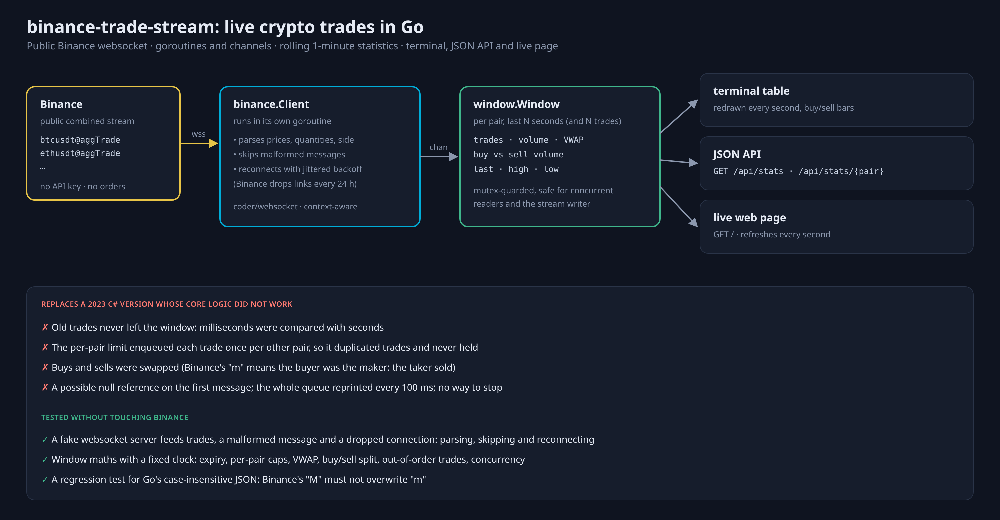
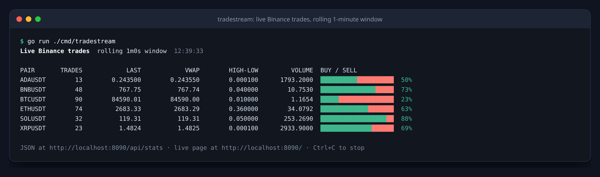
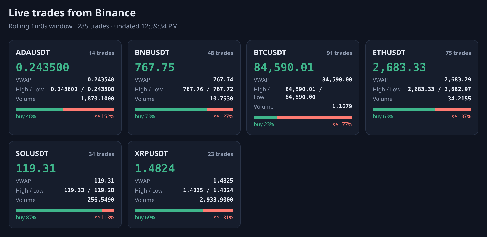
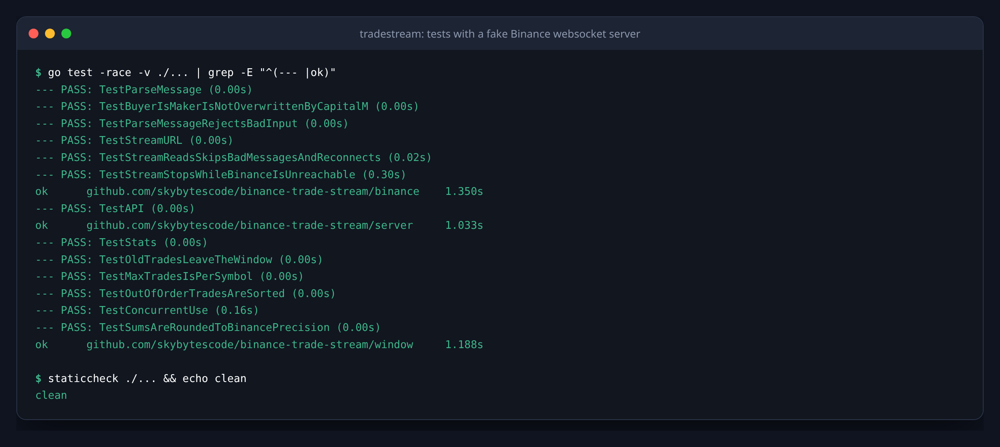

# binance-trade-stream

[](https://github.com/skybytescode/binance-trade-stream/actions/workflows/ci.yml)

Follows live trades on Binance for a few pairs and keeps rolling statistics
for each one: trade count, volume, buy vs. sell volume, VWAP, last price,
high and low. It shows them as a live terminal table, a JSON API and a small
live web page.

It uses Binance's **public** market-data websocket only: no API key, no
account, no orders.



## Run it

```bash
go run ./cmd/tradestream                                   # BTC, ETH, SOL, BNB, XRP, ADA
go run ./cmd/tradestream -symbols btcusdt,ethusdt -window 5m -max-trades 500
make docker                                                # API only, in a 16 MB image
```



| Flag | Default | Meaning |
|---|---|---|
| `-symbols` | six major USDT pairs | Comma-separated pairs |
| `-window` | `1m` | Length of the rolling window |
| `-max-trades` | `0` (no limit) | Keep at most this many trades per pair in the window |
| `-http` | `:8090` | Address of the JSON API and live page (empty: off) |
| `-table` | `true` | Redraw the terminal table every second |
| `-url` | Binance's public stream | Combined-stream URL |

### JSON API and live page

```bash
curl localhost:8090/api/stats           # every pair
curl localhost:8090/api/stats/ethusdt   # one pair
```

```json
{
  "symbol": "ETHUSDT",
  "trades": 74,
  "volume": 34.0792,
  "quote_volume": 91444.264355,
  "buy_volume": 21.3662,
  "sell_volume": 12.713,
  "vwap": 2683.28670729,
  "last": 2683.33,
  "high": 2683.33,
  "low": 2682.97,
  "last_trade": "2026-10-03T12:39:32.479+03:00"
}
```

http://localhost:8090/ shows the same numbers as cards that refresh every
second:



## How it works

- **`binance`**: connects to the combined `<pair>@aggTrade` streams, parses
  each message, and sends trades on a channel. Malformed messages are logged
  and skipped. When the connection drops, as Binance does to every connection
  after 24 hours, it reconnects with jittered exponential backoff.
- **`window`**: per pair, keeps the trades from the last window (and at most
  `-max-trades` of them), drops older ones on every read, and computes the
  statistics. It is safe for the stream writer and the readers at once.
  Sums are rounded to Binance's 8-decimal precision.
- **`server`**: the JSON API and the embedded live page.
- **`cmd/tradestream`**: wires them together and stops cleanly on Ctrl+C.

The trade side follows Binance's `m` flag: `m: true` means the buyer was the
maker, so the taker **sold**.

## Tests

```bash
go test -race ./...    # no network needed
```

- **Stream client** against a fake websocket server that sends trades, a
  malformed message, and then drops the connection: parsing, skipping,
  reconnecting, and stopping cleanly while Binance is unreachable.
- **Parsing** with a real message from the live stream, including a
  regression test for a Go pitfall: `encoding/json` matches keys
  case-insensitively, so without care Binance's `"M"` (always true) overwrites
  `"m"` and every trade looks like a sell.
- **Window** with a fixed clock: expiry, per-pair caps, VWAP, buy/sell split,
  out-of-order trades, rounding and concurrent use.
- **HTTP** handlers.

[GitHub Actions](.github/workflows/ci.yml) runs gofmt, `go vet`, staticcheck,
the tests with the race detector, and builds the Docker image.



## History

This replaces a 2023 C# console app built on the same idea. Its core logic
did not work: trades never left the 1-minute window (milliseconds were
compared with seconds), the per-pair limit duplicated trades instead of
limiting them, buys and sells were swapped, it could crash on the first
message, and it reprinted the whole queue ten times a second.
